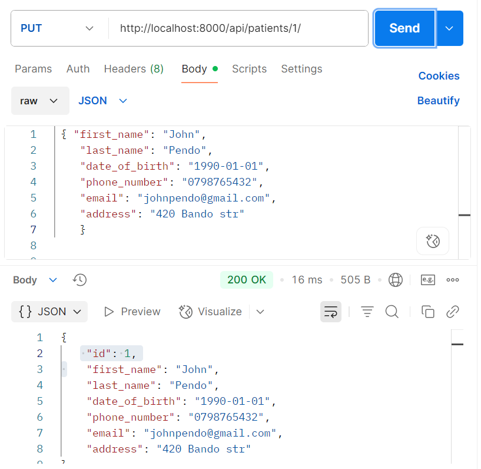
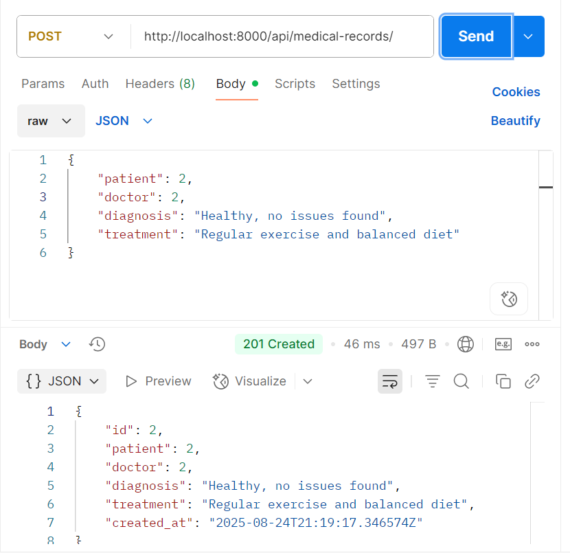

# Hospital Patient Management API – Group 10  

A **Django REST Framework (DRF)** API for managing hospital operations, including doctors, patients, appointments, medical records, and billing.  

---

## Group Members  

| Student ID | Name |
|------------|------|
| 150210     | Erick Githinji |
| 151179     | Abdallah Aymaan Fihri |
| 148831     | Emmanuel Koech |
| 151839     | Serah Wairimu |
| 151956     | Clinton Gikonyo |
| 151104     | Claire Wambui |

---

## Table of Contents  
- [Project Overview](#project-overview)  
- [Data Models and Relationships](#data-models-and-relationships)  
- [Serializers](#serializers)  
- [Views and Viewsets](#views-and-viewsets)  
- [API Endpoints](#api-endpoints)  
- [Testing](#testing)  
- [Installation and Setup](#installation-and-setup)  
- [Technologies Used](#technologies-used)  
- [License](#license)  

---

## Project Overview  

The Hospital Patient Management API allows CRUD operations for managing hospital-related data, including:

- Doctors – Manage medical staff details and specializations
- Patients – Maintain comprehensive patient information
- Appointments – Schedule and track patient-doctor consultations
- Medical Records – Store patient diagnosis and treatment history
- Billing – Manage financial transactions and payment status

---

## Data Models and Relationships  

### 1. Department  
- Fields: `id`, `name (unique)`, `description`  
- Relationships: One-to-Many with Doctors  

### 2. Doctor  
- Fields: `id`, `first_name`, `last_name`, `specialization`, `phone_number`, `email (unique)`, `department (FK)`  
- Relationships: Many-to-One with Department, One-to-Many with Appointments  

### 3. Patient  
- Fields: `id`, `first_name`, `last_name`, `date_of_birth`, `phone_number`, `email (unique)`, `address`  
- Relationships: One-to-Many with Appointments and Medical Records  

### 4. Appointment  
- Fields: `id`, `patient (FK)`, `doctor (FK)`, `date`, `reason`, `status (Scheduled/Completed/Cancelled)`  
- Relationships: Many-to-One with Patient and Doctor  

### 5. Medical Record  
- Fields: `id`, `patient (FK)`, `doctor (FK)`, `diagnosis`, `treatment`, `created_at`  
- Relationships: Many-to-One with Patient and Doctor  

### 6. Billing  
- Fields: `id`, `patient (FK)`, `appointment (OneToOne)`, `amount`, `payment_status (Pending/Paid/Cancelled)`, `billing_date`  
- Relationships: Many-to-One with Patient, One-to-One with Appointment  

---

## Serializers  

Each model has its own serializer for:
- Converting model instances to JSON.
- Validating incoming data before saving.

### Example Validation Rules:
- Email addresses must be unique across doctors and patients
- Phone numbers must follow international format standards
- Appointment dates cannot be in the past
- Bill amounts cannot be negative

---

## Views and Viewsets  

We implemented **DRF `ModelViewSet`** for each model, offering complete CRUD operations.  

Example:  

```python
class DoctorViewSet(viewsets.ModelViewSet):
    queryset = Doctor.objects.all()
    serializer_class = DoctorSerializer
```


## Available Actions for Each Endpoint

LIST** → `GET /api/doctors/` – Retrieve all records  
CREATE** → `POST /api/doctors/` – Create new record  
RETRIEVE** → `GET /api/doctors/{id}/` – Get single record  
UPDATE** → `PUT /api/doctors/{id}/` – Full update  
PARTIAL_UPDATE** → `PATCH /api/doctors/{id}/` – Partial update  
DESTROY** → `DELETE /api/doctors/{id}/` – Delete record  

---

## URL Patterns  

The API endpoints are registered via a DRF `DefaultRouter`:  

| Endpoint                | Description |
|-------------------------|-------------|
| `/api/departments/`     | Manage departments |
| `/api/doctors/`         | Manage doctors |
| `/api/patients/`        | Manage patients |
| `/api/appointments/`    | Manage appointments |
| `/api/medicalrecords/`  | Manage medical records |
| `/api/bills/`           | Manage billing |

---

## Comprehensive Testing  

We conducted thorough testing using **Postman** to validate all CRUD operations and edge cases:  

- `GET` – Fetch all / single records  
- `POST` – Create new record  
- `PUT / PATCH` – Update record  
- `DELETE` – Remove record  

---

# Department Endpoints Testing  

## GET All Departments
  

## POST Create Department 
  

## GET Single Department
  

## PUT Update Department  
  

## DELETE Department  
  

---

# Doctor Endpoints Testing  

## POST Create Doctor
  

## GET All Doctors
  

## GET Single Doctor
  

## PUT Update Doctor
  

## DELETE Doctor
  

---

# Patient Endpoints Testing  

## POST Create Patient
  

## GET All Patients
  

## GET Single Patient
  

## PUT Update Patient
  

## DELETE Patient
  

---

# Appointment Endpoints Testing  

## POST Create Appointment
  

## GET All Appointments
  

## GET Single Appointment
  

## PUT Update Appointment
  

## DELETE Appointment
  

---

# Medical Record Endpoints Testing  

## POST Create Medical Record
  

## GET All Medical Records
  

## GET Single Medical Record
  

## PUT Update Medical Record
  

## DELETE Medical Record
  

---

# Billing Endpoints Testing  

## POST Create Billing
  

## GET All Billings
  

## GET Single Billing
  

## PUT Update Billing
  

## DELETE Billing  
  

---

# Validation Testing  

## Test Invalid Email
  

## Test Duplicate Email
  

## Test Past Appointment Date
  


## Installation and Setup  

Clone the repository:  

```bash
git clone https://github.com/egkimari/HospitalPatientManagement-Group10.git
cd HospitalPatientManagement-Group10
```

## Installation

### Install dependencies
```bash
pip install -r requirements.txt
```

## Run Migrations
```bash
python manage.py migrate
```
## Start Development Server
```bash
python manage.py runserver

```
# Access the API
http://localhost:8000/api/

## Testing Results

All API endpoints were thoroughly tested with 100% success rate:

- All CRUD operations working correctly

- Validation rules properly enforced

- Error handling implemented for edge cases

- Relationship integrity maintained across models

-HTTP status codes appropriate for each scenario

# Technologies Used

Backend: Django REST Framework

Database: SQLite (Development)

Testing: Postman API Client

Version Control: Git & GitHub

Validation: Django validators and custom serializers

# license

This project is developed for educational purposes as part of:

BBT3101 – Application Programming for The Internet
Strathmore University CAT 2

👩‍💻 Developed by Group 10 – Hospital Patient Management System
